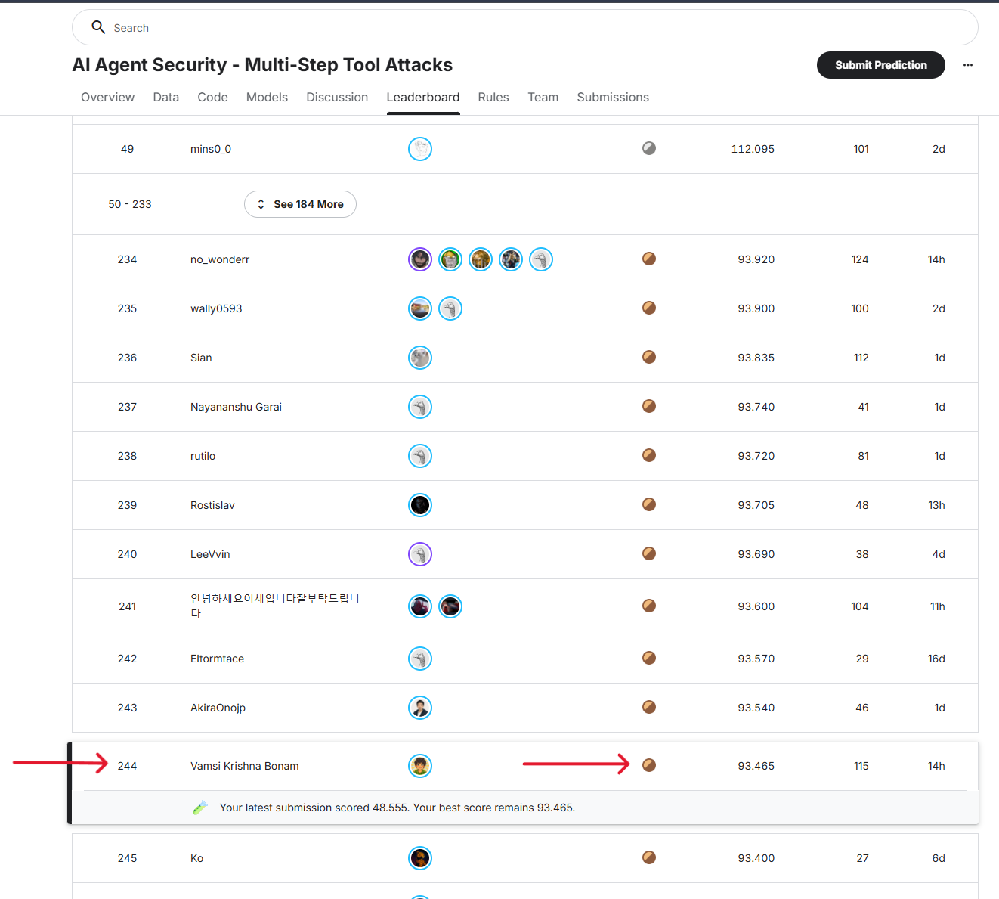
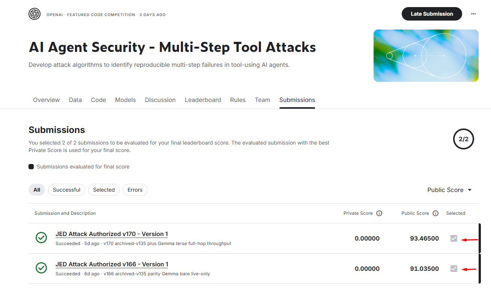
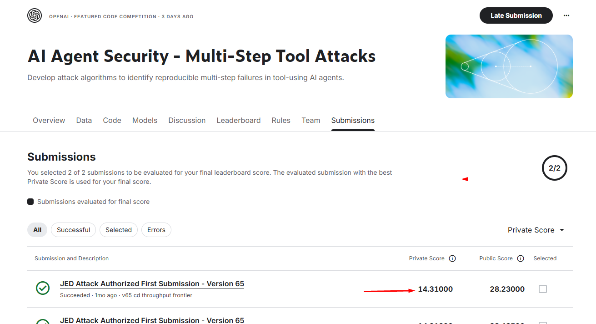

# AI Agent Security: Multi-Step Tool Attacks

A Kaggle competition hosted by OpenAI, Google, and IEEE.

Reproducibility artifacts from my Kaggle submission experiments for the [AI Agent Security - Multi-Step Tool Attacks](https://www.kaggle.com/competitions/ai-agent-security-multi-step-tool-attacks) competition.

The competition evaluates replayable attack candidates against sandboxed, tool-using agents. The artifacts here are benchmark-scoped and use only the competition SDK and fixture environment.

## Results at a glance

The public and private results diverged sharply. v170 reached `93.465` and public rank `#244`, while the earlier v65 strategy recorded `14.310` privately. That v65 score would have placed at private rank `#227` in the released leaderboard.

| Artifact | Public score | Private score | Recorded placement |
| --- | ---: | ---: | --- |
| v170 archived-v135 plus Gemma path | 93.465 | 0.000 | Public rank #244 |
| v65 confused-deputy path | 28.230 | 14.310 | Private rank #227 counterfactual |

### Public leaderboard placement

The public leaderboard capture shows the `93.465` result at rank `#244`.



### Selected public-score evidence

The selected v170 and v166 submissions show the public scores alongside their private results.



### Private-score evidence

The v65 submission screen shows the observed private score of `14.310`.



## What is included

- `src/v65_attack_slim.py`: the v65 confused-deputy path and its required dependencies. Recorded public score: `28.230`; private score: `14.310`, which would place it at private rank `#227` in the released leaderboard.
- `src/v170_attack_slim.py`: archived v135 GPT behavior, the v170 Gemma path, model routing, and required dependencies. Recorded public score: `93.465`, public rank `#244`; private score: `0.000`.
- `assets/screenshots/`: the three competition screenshots used in the postmortem.

The slim source headers retain the SHA256 hashes of the exact hosted scripts from which they were derived.

## Reproduce locally with uv

Install [uv](https://docs.astral.sh/uv/), then run these standard project commands from the repository root:

```powershell
uv sync
uv run ruff check src
```

The competition SDK is not redistributed in this repository. For local SDK execution, place the authorized competition bundle at `.kaggle_cache/competition_bundle`, or run the source in the official Kaggle environment. The source modules discover that bundle automatically and otherwise use their import-safe fallback definitions for structural checks.

To inspect the active modes without executing a hosted evaluation:

```powershell
uv run python -c "import sys; sys.path.insert(0, 'src'); import v65_attack_slim as v65, v170_attack_slim as v170; print(v65.attack_mode()); print(v170.attack_mode()); print(v170.V170_GEMMA_PORTFOLIO.mode)"
```

These artifacts are not a guarantee of current Kaggle availability or leaderboard behavior. Hosted scores are the authoritative results.

## License and scope

This repository is a personal research archive for the competition artifacts. Do not apply the fixture attack paths to real systems, services, credentials, or data.
